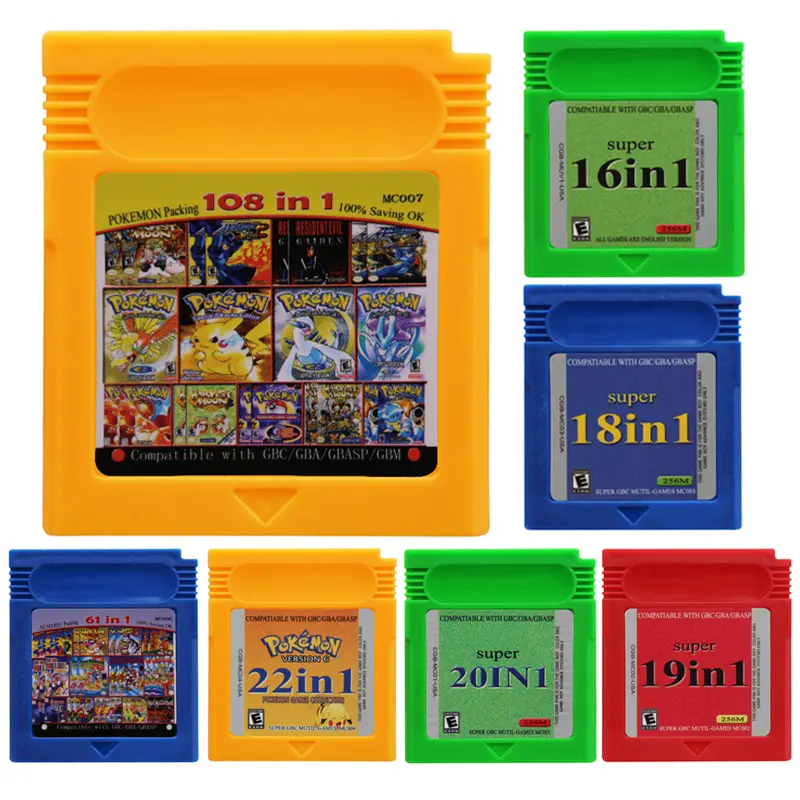

# Just Give Me the ROM!
Download the [current release](https://github.com/nummacway/LSDj-GB-HiCol-Mapper-Hack/releases) from this repository and patch the given version of [LSDj](https://www.littlesounddj.com/lsd/index.php) with [beat](https://www.romhacking.net/utilities/893/). Then burn to a GB HICOL cart.

# Introduction
LSDj is a Game Boy music tracker software that requires [MBC5](https://gbdev.io/pandocs/MBC5.html) cartridges with 128 KiB of SRAM (16 banks of 8 KiB). Those are hard to find and/or expensive. Single-game bootlegs on AliExpress only support 4 MiB of ROM and 32 KiB of SRAM, even if bigger chips are built into the cart (which is usually the case).

# Solution
However, AliExpress has [multicart bootlegs with a whopping 32 MiB of ROM and 512 KiB of RAM](https://bootleggames.fandom.com/wiki/GB_HICOL_Multicarts). They are quite inexpensive. The normal price is USD 7.50 plus taxes, but at the time of writing, I found [an offer that accepted AliExpress coins for a whopping 50% discount](https://de.aliexpress.com/item/1005009664141032.html) so I would pay a total of USD 8.38 (including German taxes and shipping) for a pack of two. It makes sense to buy two because if you only buy one, the price before discount is below USD 10, so you'd have to pay USD 2.99 for shipping. Better pay USD 4.39 for a second cart because the quality of these carts varies (for example, my 61-in-1's ROM sucks, but my other 5 are fine (I don't have a 22-in-1)), so having two gives you a higher chance to get at least one good one. Luckily, LSDj will even tell you if your cart sucks when it boots up. Note: The [A22I_EXAMPLE](https://bootleggames.fandom.com/wiki/Pok%C3%A9mon_All_FAIRY) (also known as the Pokémon All FAIRY) is a way different mapper and the cart doesn't even have persistent SRAM, so it is not supported.

 _Image of all currently-sold English-language multicarts supported by this patch. The 61-in-1 and 108-in-1 are available in different colors._

By default, those multicarts mimic a standard 8 MiB MBC5 cart with 32 KiB of RAM, but have three special mapper registers at `$7000`, `$7001` and `$7002`. A detailed documentation of these registers is found [here](https://github.com/nummacway/repro-carts#gb-hicol-multicarts). By writing to these registers, the menu with the internal name "GB HICOL" (English) or "GB HiCol" (Chinese) sets up the mapper. Among certain other features, it can map any power of 2 between 32 KiB and 8 MiB of ROM from an offset that's divisable by ROM size. It can also map 0, 8 or 32 KiB of RAM (0, 1 or 4 banks). Games with the same `offset / 2 MiB` (rounded down) share the same RAM (8 KiB mode equals the 32 KiB mode's highest bank).

The GB HICOL mapper however is different from the MBC5 mapper when it comes to accessing more than 32 KiB of RAM. When using an 128 KiB MBC5, you can access any of the 16 banks by simply writing the bank number to any address between `$4000` and `$5fff`, GB HICOL only maps 4 banks at a time, so any bank number writted to that range is interpreted modulo 4. If you want to access any other 4 RAM banks, you must also change the mapped ROM area to a game in a different 2 MiB ROM block. Any writes to `$7000`, `$7001` and `$7002` come into effect immediately (this is why the menu runs these writes from HRAM rather than ROM or SRAM).

The solution therefore is:
- Make a patch that writes the highest two bits of the RAM bank number to the GB HICOL ROM selection registers instead.
- Write the patched ROM in four different SRAM blocks (different ROM blocks of 2 MiB), so the (same) ROM is available to all four SRAM blocks of 4 banks each.

# Making the Patch
By running LSDj in an emulator, you can find out that LSDj obviously only writes to `$4000` and thankfully not the entire `$4000`-`$5fff` range. It does so by doing the following things to change SRAM bank:
1. Load register `A` to the immediate address `[$4000]`. (`A` is the only thing a Game Boy CPU can write to an immediate address.)
2. Load `$4000` to the `HL` registers. Immediately after that (right in the next instruction), load to the address `[HL]` one of the following values:
   - Register `A` (this makes no sense at all because it is slower and uses more space than method 1 (unless you _later_ make use of `HL` being `$4000` - which I don't think LSDj ever does), but is used at `$4026`, `$408A` and `$70011`)
   - Register `C` (only found at `$4468`)
   - Immediate data `0` to `4` (the latter is only found at `$70383`).

Luckily, any of these 8 code snippets requires at least 3 bytes of bytecode that you can replace with a 3-byte `CALL` instruction to a new function. Because there is enough free space at the end of ROM bank 0 (bank 0 is never banked), we can put our new functions in bank 0 and don't have to care about the ROM bank at all.

As explained earlier, the GB HICOL is a 8 MiB cart by default and can only map aligned ROM areas (mapped offset divisable by mapped size). So we also need to inject some code into the init sequence that sets the ROM size to 1 (size of LSDj) or 2 MiB (size of a ROM block sharing RAM). Which of the two doesn't matter, because LSDj's ROM check is hardcoded to 1 MiB and does not care if the mapper maps more. In theory, you could also use the 32 KiB SRAM blocks 0, 4, 8 and 12 that a 8 MiB ROM can map, but the RAM would not be consecutive when dumping RAM (so it won't be compatible with emulators) and you would have to write a much larger final ROM (at least 25 MiB) to the cart.

When you burn the patched ROM using FlashGBX, it will complain about the ROM not matching the mapper (which is a lie) but will still write it and it will run.

If you are using FlashGBX, please note that FlashGBX neither knows that GB HICOL is a single cart by default, nor does it know how to process RAM correctly. You'll probably have to use a hex editor to change between 128 KiB and 512 KiB size.

# Code

The is the full code required for the hack:

|         | Old Bytecode          | Old  ASM                       | New Bytecode               | New ASM                        | Target Bytecode                                                        | Target ASM                                                                                    |
| ------- | --------------------- | ------------------------------ | -------------------------- | ------------------------------ | ---------------------------------------------------------------------- | --------------------------------------------------------------------------------------------- |
| **2.C** | `21 00 40` `71`    | `ld hl, $4000` `ld [hl], c` | `CD B7 3F` `00`         | `call $3FB7` `nop`          | `F5` `79` `CD E5 3F` `F1` `C9`                             | `push af` `ld a, c` `call $3FE5` `pop af` `ret`                                   |
| **2.0** | `21 00 40` `36 00` | `ld hl, $4000` `ld [hl], 0` | `CD BE 3F` `00` `00` | `call $3FBE` `nop` `nop` | `F5` `97` `CD E5 3F` `F1` `C9`                             | `push af` `sub a` `call $3FE5` `pop af` `ret`                                     |
| **2.1** | `21 00 40` `36 01` | `ld hl, $4000` `ld [hl], 1` | `CD C5 3F` `00` `00` | `call $3FC5` `nop` `nop` | `F5` `3E 01` `CD E5 3F` `F1` `C9`                          | `push af` `ld a, 1` `call $3FE5` `pop af` `ret`                                   |
| **2.2** | `21 00 40` `36 02` | `ld hl, $4000` `ld [hl], 2` | `CD CD 3F` `00` `00` | `call $3FCD` `nop` `nop` | `F5` `3E 02` `CD E5 3F` `F1` `C9`                          | `push af` `ld a, 2` `call $3FE5` `pop af` `ret`                                   |
| **2.3** | `21 00 40` `36 03` | `ld hl, $4000` `ld [hl], 3` | `CD D5 3F` `00` `00` | `call $3FD5` `nop` `nop` | `F5` `3E 03` `CD E5 3F` `F1` `C9`                          | `push af` `ld a, 3` `call $3FE5` `pop af` `ret`                                   |
| **2.4** | `21 00 40` `36 04` | `ld hl, $4000` `ld [hl], 4` | `CD DD 3F` `00` `00` | `call $3FDD` `nop` `nop` | `F5` `3E 04` `CD E5 3F` `F1` `C9`                          | `push af` `ld a, 4` `call $3FE5` `pop af` `ret`                                   |
| **2.A** | `21 00 40` `77`    | `ld hl, $4000` `ld [hl], a` | `CD E5 3F` `00`         | `call $3FE5` `nop`          | `21 00 40`                                                             | `ld hl, $4000`                                                                                |
| **1**   | `EA 00 40`            | `ld [$4000], a`                | `CD E8 3F`                 | `call $3FE8`                   | `F5` `CB 37` `E6 C0` `EA 00 70` `F1` `EA 00 40` `C9` | `push af` `swap a` `and 192` `ld [$7000], a` `pop af` `ld [$4000], a` `ret` |
| **Init** `$101`  | `C3 50 01`| `jp $150`                      | `C3 F5 3F`                 | `jp $3FF5`                     | `F3` `F5` `3E C0` `EA 01 70` `F1` `C3 50 01`            | `di` `push af` `ld a, 192` `ld [$7001], a` `pop af` `jp $150`                  |

The number in the first column refers to the numbers in the "Making the Patch" chapter. Remarks:
- 2.0: `sub a` (or `xor a`) is a shorter instruction to load 0 into `A`.
- 2.A: This is cleverly using the fact the the only difference to method 1 is that it also sets `HL` to `$4000`, so it does this first and then continues with method 1 (no need to `call`!). This saves space. Space isn't tight right now but might change in the future.
- 1: Bits 2 and 3 of the bank have to end up in bits 6 and 7 of `$7000` (the ROM offset). `swap` swaps nibbles, so that works. `and 192` makes sure that the ROM offset is actually divisable by its size with no remained. I do not currently know if the GB HICOL mapper cares about this or if it ignores offset bits that aren't applicable to the current ROM size.
- Init: `di` (disable interupts) is simply the first thing the original code does. I guess it's for soft resets. The immediate data value of 192 is the GB HICOL's mask for mapping 2 MiB ROMs. You could also map 1 MiB (mask 224) for the same result.

The code above only _adds_ GB HICOL support. It does not remove support for neither MBC5 carts with 128 KiB of RAM nor emulators.

# Patching manually
1. Except for the last row (Init), use a hex editor to replace all occurences of the sequence in the second column with the respective sequence in the fourth column. While doing a binary replace is usually dangerous, 3 bytes is quite a long sequence for a 1 MiB file, and all replaced data includes `21 00 40` or `EA 00 40` which doesn't really have a use other than changing SRAM banks.
2. Stuff `F5 3F` at `$102`.
3. Stuff the contents of the entire second-to-last column (or the `.bin` file from this repository) at `$3FB7`.
4. Save and run `rgbfix -f g` on your ROM. You can get `rgbfix` from [RGBDS](https://github.com/gbdev/rgbds).
5. Concatenate copies of the resulting ROM until you get at least a 7 MiB ROM.
